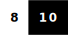
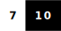

## Hi there 👋

My name is Ivan.
I'm a software developer.
I work as a software engineer.
I'm also a systems analyst.

<strong>Programming</strong>

  
### Main Stack

|Section|Name|Skill Level|About|
|---|---|---|---|
|Workstation OS|Windows||https://www.microsoft.com/en-us/download/windows|
|Server OS|Linux - Ubuntu||https://ubuntu.com/download/server|
|Envinronment|Deamon(Services)||https://manpages.ubuntu.com/manpages/jammy/man1/systemctl.1.html|
|Envinronment|Docker(Compose)||https://docs.docker.com/compose/|
|Platform|.dotnet(.NetCore)||https://dotnet.microsoft.com/|
|Platform|Blazor||https://dotnet.microsoft.com/en-us/apps/aspnet/web-apps/blazor|
|Framework|MudBlazor||https://mudblazor.com/|

