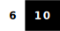
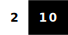

<h3 align="center">Hi there 👋</h3>

Website • X • LinkedIn • YouTube • TikTok

---

My name is Ivan.
I'm a software developer.
I work as a software engineer.
I'm also a systems analyst.

---

<strong>Programming</strong>

  
### Main Stack

|Section|Name|Skill Level|About|
|---|---|---|---|
|Workstation OS|Windows||https://www.microsoft.com/en-us/download/windows|
|Server OS|Linux - Ubuntu||https://ubuntu.com/download/server|
|Envinronment|Deamon(Services)||https://manpages.ubuntu.com/manpages/jammy/man1/systemctl.1.html|
|Envinronment|Docker(Compose)||https://docs.docker.com/compose/|
|Platform|.Net||https://dotnet.microsoft.com/|
|Backend|ASP.NET Core||https://dotnet.microsoft.com/en-us/apps/aspnet|
|ORM|Entity Framework||https://learn.microsoft.com/ru-ru/ef/|
|Frontend|Blazor||https://dotnet.microsoft.com/en-us/apps/aspnet/web-apps/blazor|
|UI Framework|MudBlazor||https://mudblazor.com/|

### Learning

|Section|Name|Skill Level|About|
|---|---|---|---|
|CI\CD|Kubernetes||https://kubernetes.io/|
|Backend|GoLang||https://go.dev/|
|Backend|Node.js||https://nodejs.org/en|
|Backend Framework|NestJS||https://nestjs.com/|
|Frontend Framework|NextJS||https://nextjs.org/|
|Frontend Framework|VueJS||https://vuejs.org/|

